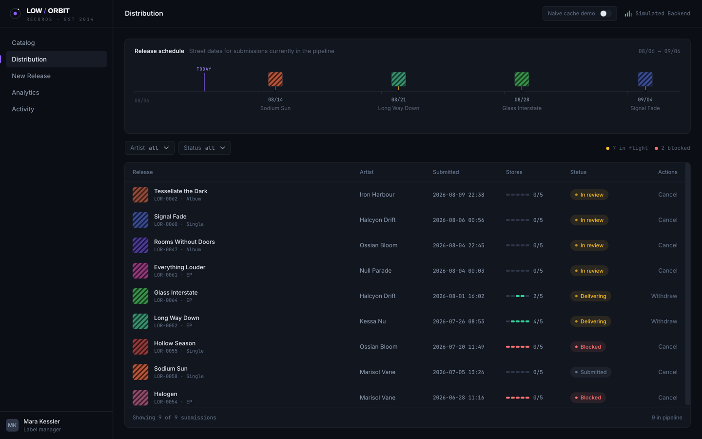
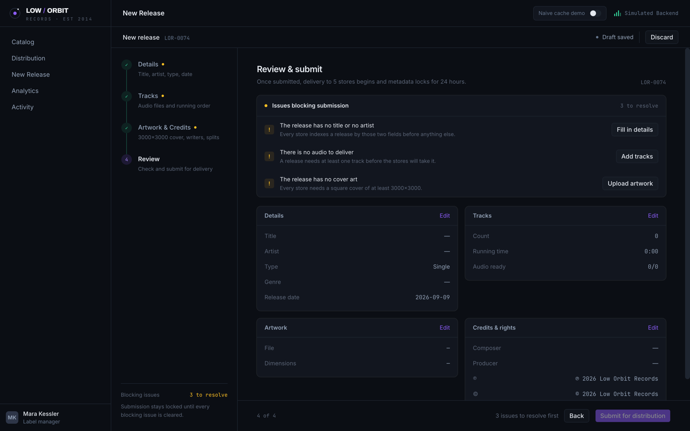
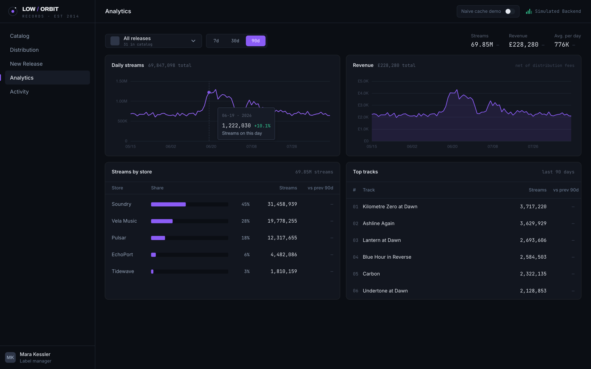
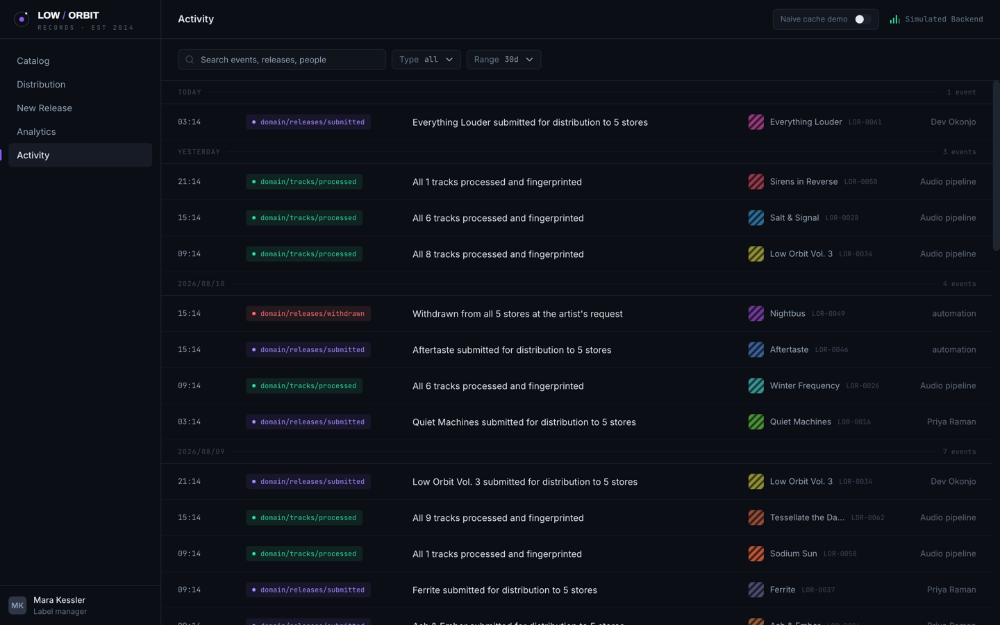
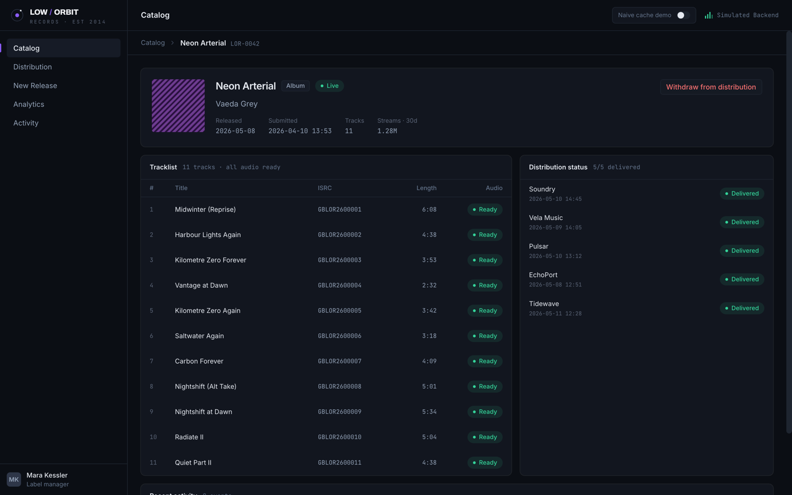
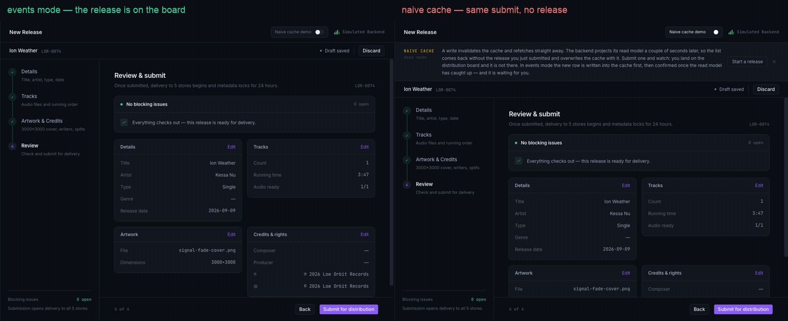

# Jettison

[](https://github.com/kkatsi/jettison-react/actions/workflows/ci.yml)
[](https://github.com/kkatsi/jettison-react/actions/workflows/jettison-test.yml)

**[Live demo](https://jettison.kkatsi.workers.dev)** — the whole console runs in your browser: there is no server, the API is a service worker (ADR-002). Add `?cache=naive` to watch Chapter 4's failure happen on purpose.

> **jettison** (v.) — to throw cargo overboard, deliberately, to keep the ship flying.

**Jettison is an enforced architecture for enterprise React applications.** Its boldest claim is its name: any module in a Jettison codebase can be thrown overboard — delete its folder, then strip its registration lines from the app shell — and the application still compiles and runs. Stripping them is mechanical, which is the real claim: a module that needs judgement to remove was never jettisonable. That is not a diagram in a wiki; it is a CI job (**the jettison test**) that runs on every push.

Not a folder structure, not a style guide — a system of rules with teeth: every boundary is a lint error, every claim of modularity is machine-verified, and every decision is recorded with its costs stated honestly.

The documentation is the product. The application in this repo — the operations console of **Low Orbit Records**, a fictional indie record label — exists to prove the rules survive contact with a real product: forms, wizards, cross-module data flow, an eventually consistent backend, and charts.

---

## The thesis

Most React architectures fail the same way: they are described, agreed on, and then violated one convenient import at a time. Six months later the diagram in the wiki describes a codebase that no longer exists.

Jettison's position: **an architecture that is not enforced is a suggestion.** Every structural rule in this system exists in two forms — a documented rationale (the chapters below) and a machine check (lint rules, CI jobs). If a rule cannot be enforced, it is demoted to advice and labeled as such.

The second position: **modularity must be falsifiable.** "Loosely coupled" is not a property you assert — it is a property you test. Hence the jettison test: remove any module and the ship keeps flying, verified in CI on every push.

## The architecture, at a glance

Four layers. **Imports flow one way — `app → modules → shared → core` — and never back.**

| Layer | What lives there | May import |
|---|---|---|
| `app` | The shell that composes: router, store, providers, layouts. The only layer that knows which modules exist. | everything below |
| `modules` | A business capability, whole: its routes, screens, endpoints, services, state. | `shared`, `core` — **never another module** |
| `shared` | Business-agnostic and reusable: UI kit, the domain event vocabulary, generic utils. | `core` |
| `core` | Infrastructure with no domain knowledge: the API client, cache utilities, config. | nothing above it |

Three corollaries do most of the work: **modules never import each other** (if two need the same thing it moves down, or gets duplicated); **a module is reachable only through its `index.ts`**, so everything behind it stays refactorable; and **only `app` composes**, so no module knows the shell exists.

Every module has the same internal shape, and no folder exists before it is needed:

```
modules/<name>/
├── index.ts        # PUBLIC API — routes, and nothing else unless deliberate
├── routes.tsx      # the module's route tree (lazy screens)
├── api/            # the endpoints THIS module owns, and their cache effects
├── screens/        # one folder per routed screen — composition only
├── features/       # big self-contained chunks of behaviour
├── components/ hooks/ services/ state/
└── types.ts constants.ts
```

Inside a component: **views render, hooks orchestrate, services decide.** A `.tsx` file may not fetch, dispatch or navigate; a service is plain TypeScript with no React and no store, which is why the rules that lose money are the ones with unit tests.

Then the part that makes it hold: **every one of those sentences is a lint error when broken**, and a CI job deletes each module in turn to prove the rest of the app does not depend on it.

## The four pillars

| # | Chapter | One-line claim |
|---|---------|----------------|
| 1 | [Layers & the jettison test](docs/01-layers.md) | Code flows in one direction — `app → modules → shared → core` — and every module is jettisonable. |
| 2 | [Module anatomy](docs/02-module-anatomy.md) | Every module has the same internal shape, features are mini-modules, and no folder exists before it is needed. |
| 3 | [The component pattern](docs/03-component-pattern.md) | Views render, hooks orchestrate, services decide. Thirteen rules make it law. |
| 4 | [The data layer](docs/04-data-layer.md) | One API client, module-owned endpoints, and cross-module cache sync through domain events — because tag invalidation lies when your backend is eventually consistent. |

The chapters are written library-agnostic; the concrete choices behind the reference implementation — including the ones with real costs — live in [`docs/adr/`](docs/adr).

### The problems it answers

Every rule here exists because of something that happened, not because it is tidy:

| The everyday pain | What answers it |
|---|---|
| "I touched billing and checkout broke." / "We can't delete this feature because nobody knows what depends on it." | Layers + the jettison test — coupling becomes a lint error, and jettisonability is a CI job |
| "Where does this file go?" — asked in every PR, answered differently every time | One module shape, one promotion ladder, folders that appear only when earned |
| The 300-line component nobody wants to touch, with business rules you cannot unit-test without mounting half the app | Views render, hooks orchestrate, services decide |
| The architecture wiki page that described the codebase two years ago | Rules ship as `error` from day one, and a suite asserts each one still fires |
| "It works on the edit screen but the list doesn't update" | Mutations own their cache effects; cross-module sync travels as domain events |
| "Why is it built this way?" answered by archaeology | ADRs, each with its costs written down

## What's in this repo

One application — the **Low Orbit Records console** — carrying the whole system:

```
jettison-react/
├── README.md                 # You are here
├── docs/                     # The architecture — four chapters, ADRs, generated dependency matrix
├── oxlint.config.ts          # The enforcement — every boundary rule, heavily commented, copyable
├── tools/oxlint/             # The layer + module-privacy rules, as a local plugin
├── fixtures/                 # Deliberately violating files; Vitest asserts each rule fires
├── scripts/                  # incl. the jettison-test module unregistration script
├── .github/workflows/        # CI + the jettison test
└── src/
    ├── app/                  # Shell: router, store, providers, layouts
    ├── modules/              # release-editor · catalog · analytics · activity
    ├── shared/               # ui kit, the domain event vocabulary, generic utils
    ├── core/                 # api client, cache utils, reactions, what an event is, config
    └── mocks/                # MSW backend with deliberate eventual consistency
```

**The jettison test** is a CI job, not a claim: for every module under `src/modules/`, a matrix job deletes the folder, runs [`scripts/unregister-module.mjs`](scripts/unregister-module.mjs) to strip its registration lines from the app shell, and requires `type-check` and `build` to pass without it. Unregistering is mechanical — an import line and whatever sits inside the `// jettison:…` marker regions — because a module that needs judgement to remove was never jettisonable. [`src/modules/activity/`](src/modules/activity) is the copyable example: the whole module template at its smallest honest size, and the test's cheapest victim.


The picture above is generated from the real import graph by [`scripts/dependency-graph.mjs`](scripts/dependency-graph.mjs), using the same classification functions the lint rule uses, and CI fails if the committed copy is stale. The hatched regions are the imports the architecture forbids: a module reaching sideways to another module, or any layer reaching up. They are empty because lint will not let them fill — and if one ever did, the number would appear here in red before anyone read the diff. `shared` imports `core` exactly once.

**`oxlint.config.ts`** is a deliberate showpiece: the entire boundary system — layers, module privacy, view and service restrictions — as one annotated config you can read top-to-bottom and adapt to your own codebase. The two rules no linter ships, layer direction and module privacy, live in [`tools/oxlint/jettison/`](tools/oxlint/jettison/index.ts) — around a hundred lines, because a layer is a path prefix and so is an alias. A Vitest suite runs the real config against violation fixtures and asserts each rule actually fires, because a boundary config that matches nothing is indistinguishable from one that is satisfied.

**The console** is a deliberately real product: the back office of an indie record label. Release creation (a multi-step wizard with drafts and audio that processes asynchronously), catalog and distribution management (lists kept consistent across modules through domain events), and streaming analytics (charts fed by tested transformations). Its mock backend simulates **eventual consistency** — reads lag writes by seconds — because that is how music distribution actually behaves (delivery takes hours, stats lag days), and a demo backend that hides the problem would prove nothing.

### The console

Every shot below is the running app at 1440×900, captured from the production build.

[](https://jettison.kkatsi.workers.dev/catalog)

The catalogue, filtered to live releases. The filter is in the URL, so that view is a link somebody can send you — state that survives a reload belongs to the router, not to a component ([ADR-004](docs/adr/004-url-state-with-nuqs.md)).

| | |
|---|---|
|  |  |
| **Distribution.** Rows land here by domain event when a release is submitted elsewhere in the app — not by a refetch that would return a read model seconds behind ([Ch. 4 §5](docs/04-data-layer.md)). | **The wizard, at review.** Submission stays locked until every blocking issue clears. The issues come from a React-free, store-free service, which is why they can be unit-tested without mounting anything ([R5](docs/03-component-pattern.md)). |
|  |  |
| **Analytics.** Charts fed by transformations with their own tests; the 90-day window is where the seeded playlist surge shows up. | **Activity.** Every fact that crosses a module boundary, in the vocabulary `shared/events/` defines. The architecture's event names, on screen, as a feed. |
|  | |
| **A release in full.** Tracklist with ISRCs, per-track audio state, and delivery to five fictional stores — one screen assembled from a module's own endpoints, with no cross-module reads. | |

### The fourth pillar, filmed

Boundaries and their enforcement are what this repo is for. The data layer is the one pillar whose payoff is invisible in a screenshot, so it gets a recording — this is what a boundary buys at runtime, not the reason the boundary exists.



Two sessions, the same draft, the same click on **Submit for distribution**. The only difference is `?cache=naive`, which swaps patch-then-verify for plain invalidation.

Watch the row counts. On the left the release is the first row on the board you land on — the mutation wrote it into the cache, then confirmed it once the read model caught up. On the right the refetch went out immediately, the backend's read model was still seconds behind, and the response that came back — without the release — overwrote the cache. Ten in the pipeline against nine, from identical code paths and one different cache strategy ([Ch. 4 §5](docs/04-data-layer.md), [ADR-002](docs/adr/002-msw-simulated-eventual-consistency.md)).

Nothing is staged: the recording drives the real app, and both sides are aligned on when things happened rather than on frame number.

## Try to break it

Every rule in here is a lint error, not a paragraph. The fastest way to believe that is to violate one — each of these fails in about a second:

```bash
npm i && npm run lint          # green, to start from

# R1: a view reaches for the store. Add to any .tsx:
#   import { useSelector } from 'react-redux';
# → R1: a view never touches the store — move it to the colocated hook.

# The jettison rule: one module imports another. Add to a catalog file:
#   import { releaseEditorRoutes } from '@modules/release-editor';
# → modules may not import other modules — move it down to shared/core, or duplicate it.

# Module privacy: skip the front door. Add anywhere outside catalog:
#   import { pipelineStage } from '@modules/catalog/services/release-status';
# → a module is consumed only through its index.ts — services/release-status is private.

# Layer direction: core reaches up. Add to any core file:
#   import { STAGE } from '@modules/catalog/constants';
# → core is the bottom layer — it may not import modules.
```

Then break the claim the name makes, which is the one that cannot be faked:

```bash
rm -rf src/modules/analytics
node scripts/unregister-module.mjs analytics
npm run type-check && npm run build      # still green, without a module
git restore . && git clean -fd src       # put it back
```

And watch the picture change: add a cross-module import, run `npm run graph`, and the number lands in a hatched cell in red — the diagram cannot drift from the code, because it is generated from it.

## Adopting it in your codebase

The architecture is four moves, and two of them are files you copy:

1. **Declare the layers.** Four aliases in `tsconfig.json` — `@app/*`, `@modules/*`, `@shared/*`, `@core/*` — mirrored in your bundler config. This is not cosmetic: it makes every cross-layer import syntactically recognisable, which is what lets a rule target it and a relative-path disguise be banned outright.
2. **Copy the enforcement.** [`oxlint.config.ts`](oxlint.config.ts) plus [`tools/oxlint/jettison/`](tools/oxlint/jettison/index.ts). Change the alias-to-folder map in the plugin and the rest follows your layout. Ship the rules as `error` — in a migration only the folders that have adopted the layout are classified at all, so legacy code stays untouched until it moves.
3. **Keep a deliberately violating file.** [`fixtures/`](fixtures) and its Vitest suite is the step people skip, and it is the one that matters: a boundary config that matches nothing is indistinguishable from one that is satisfied.
4. **Add the jettison test.** [`scripts/unregister-module.mjs`](scripts/unregister-module.mjs) and the matrix job in [`.github/workflows/jettison-test.yml`](.github/workflows/jettison-test.yml). Wrap each registration line in a `// jettison:…` marker region and the script strips them mechanically.

**What you do not need to copy:** RTK Query, MSW, shadcn, nuqs — or oxlint itself, which is a choice like any other ([ADR-005](docs/adr/005-oxlint-with-a-local-boundaries-plugin.md) records why it won and what it cost). Chapters 1–3 name no library at all; Chapter 4's appendix maps the data layer onto TanStack Query row by row, and every ADR states what its choice costs. The layers, the module shape, the component pattern and the jettison test are the architecture. The stack is a reference implementation of it.

## Who this is for

Teams building React applications that must survive years of feature work, team turnover, and parallel development — the environment where "we all know the conventions" stops scaling. Jettison borrows its starting point from [bulletproof-react](https://github.com/alan2207/bulletproof-react) (feature folders, unidirectional flow, colocation) and extends it where enterprise codebases actually bleed: enforcement with teeth, falsifiable modularity, governance that survives turnover — and, further down the list, cross-module cache consistency and form-state ownership. Scope, stated plainly: long-lived enterprise SPAs — no SSR, no RSC, by thesis.

## Status

- [x] Chapters 1–4
- [x] ADR template + founding decisions
- [x] `oxlint.config.ts` + violation fixtures
- [x] App shell: core + shared + app layers
- [x] Jettison-test CI
- [x] Modules: activity, catalog, release-editor, analytics
- [x] Deployed demo (Cloudflare Workers) — [jettison.kkatsi.workers.dev](https://jettison.kkatsi.workers.dev)
- [x] The naive-vs-events demo, as a GIF

---

*MIT licensed. Built by Kostas Katsinaris.*
