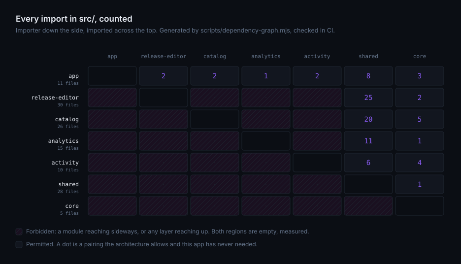
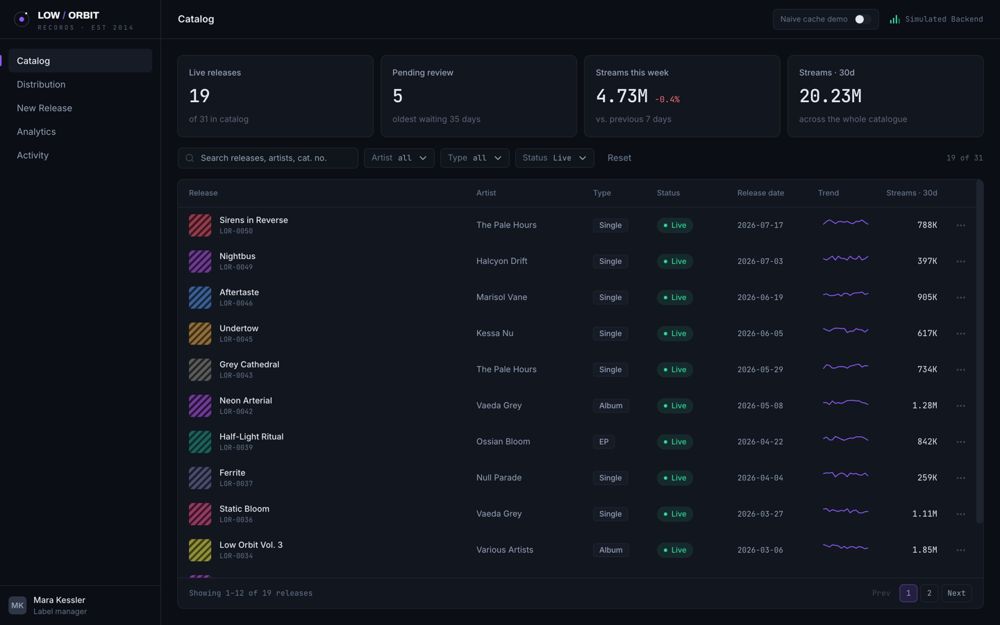

# Jettison

[](https://github.com/kkatsi/jettison-react/actions/workflows/ci.yml)
[](https://github.com/kkatsi/jettison-react/actions/workflows/jettison-test.yml)

**An enforced architecture for enterprise React.** Any module can be thrown overboard — delete its folder, strip its registration lines — and the application still compiles, builds and runs. CI proves it on every push.

[Live demo](https://jettison.kkatsi.workers.dev) · [The chapters](docs) · [Decisions and their costs](docs/adr)

> **jettison** (v.) — to throw cargo overboard, deliberately, to keep the ship flying.

## Why

Most React architectures are described, agreed on, and then violated one convenient import at a time. Six months later the diagram in the wiki describes a codebase that no longer exists.

Two positions follow from that.

**An architecture that is not enforced is a suggestion.** Every rule a linter can check ships as an error, next to the rationale for it. The rest are labelled review-enforced where they are stated, because a rule whose status goes unwritten is the one that quietly becomes advice.

**Modularity must be falsifiable.** "Loosely coupled" is not a property you assert, it is one you test. So CI deletes each module in turn and requires the rest of the app to build without it.

## What it solves

| Sounds familiar                                                      | What answers it                                                                          |
| -------------------------------------------------------------------- | ---------------------------------------------------------------------------------------- |
| "I touched billing and checkout broke."                              | Layers. Imports flow one way, and crossing them fails lint.                              |
| "We can't remove this feature, nobody knows what depends on it."     | The jettison test. Every module is provably removable.                                   |
| "Where does this file go?" — answered differently in every review    | One module shape, and folders that appear only when earned.                              |
| A 300-line component whose business rules need a mounted app to test | A fixed split between rendering, orchestration and decisions.                            |
| The wiki page that described the codebase two years ago              | Rules ship as errors, and a test suite asserts each one still fires.                     |
| "It works on the edit screen but the list doesn't update."           | Mutations own their cache effects; cross-module sync travels as events.                  |
| "It works fine" — until someone tries the wizard without a mouse     | Every accessibility rule the linter ships, at error; reachability asserted in a browser. |

## The architecture

Four layers, and imports flow one way: `app → modules → shared → core`.

| Layer     | What lives there                                                          | May import       |
| --------- | ------------------------------------------------------------------------- | ---------------- |
| `app`     | The shell that composes: router, store, providers, layouts                | everything below |
| `modules` | A business capability, whole: routes, screens, endpoints, services, state | `shared`, `core` |
| `shared`  | Business-agnostic and reusable: UI kit, event vocabulary, utils           | `core`           |
| `core`    | Infrastructure with no domain knowledge: API client, cache utils, config  | nothing above it |

Three corollaries do most of the work:

1. **Modules never import each other.** If two need the same thing it moves down to `shared` or `core` — or gets duplicated, which is often cheaper than a coupling.
2. **A module is reachable only through its `index.ts`.** Everything behind that door is private and refactorable without repo-wide impact.
3. **Only `app` composes.** The router knows which modules exist. No module knows the shell does.



Generated from the real import graph, and CI fails if the committed copy is stale. The hatched cells are the imports the architecture forbids; a number appearing there would show up here in red.

Every module has the same internal shape, and no folder exists before it is needed:

```
modules/<name>/
├── index.ts        # public API: routes, and nothing else unless deliberate
├── routes.tsx      # the module's route tree, screens lazy-loaded
├── api/            # the endpoints this module owns, and their cache effects
├── screens/        # one folder per routed screen, composition only
├── features/       # self-contained chunks of behaviour
├── components/ hooks/ services/ state/
└── types.ts constants.ts
```

Inside a component the split is fixed: views render, hooks orchestrate, services decide. A `.tsx` file never fetches, dispatches or navigates. A service is plain TypeScript with no React and no store, which is why the logic that loses money is the part with unit tests.

## The chapters

| #   | Chapter                                               | Claim                                                           |
| --- | ----------------------------------------------------- | --------------------------------------------------------------- |
| 1   | [Layers & the jettison test](docs/01-layers.md)       | Code flows one way, and every module is jettisonable            |
| 2   | [Module anatomy](docs/02-module-anatomy.md)           | Every module has the same shape; features are mini-modules      |
| 3   | [The component pattern](docs/03-component-pattern.md) | Views render, hooks orchestrate, services decide                |
| 4   | [The data layer](docs/04-data-layer.md)               | One client, module-owned endpoints, cross-module sync as events |

The chapters name no library. The concrete choices, and what each one costs, are in [`docs/adr/`](docs/adr).

## How it is enforced

[`oxlint.config.ts`](oxlint.config.ts) holds the whole boundary system as one annotated config: layers, module privacy, view and service restrictions, the type-evidence rules ([anti-slop](https://github.com/dmmulroy/anti-slop), vendored under MIT), and every accessibility rule the linter ships. The two rules no linter ships live in [`tools/oxlint/jettison/`](tools/oxlint/jettison/index.ts), about a hundred lines, because a layer is a path prefix and so is an alias.

[`fixtures/`](fixtures) keeps one deliberately violating file per rule, with a Vitest suite that fails if a rule stops firing. A boundary config that matches nothing looks exactly like one that is satisfied.

[`e2e/`](e2e) drives the console in a real browser for the claims that live in the interaction and nowhere else: a submitted release surviving the refetch that would clobber it, the same journey in `?cache=naive` landing on a board without it, a withdrawal crossing module boundaries as an event, and a popup that stays open under a press a hand would make. Each spec was verified to fail when the behaviour it names is removed — a green browser test that cannot go red is the same lie as a lint rule matching nothing.

[The jettison test](.github/workflows/jettison-test.yml) runs a matrix job per module: delete the folder, run [`unregister-module.mjs`](scripts/unregister-module.mjs), require type-check and build to pass without it.

## Try it

```bash
npm i && npm run dev
```

Then break a rule. Add any of these and run `npm run lint`:

- `import { useSelector } from 'react-redux'` in any screen or component — a view never touches the store
- `import { releaseEditorRoutes } from '@modules/release-editor'` inside `catalog` — modules may not import each other
- `import { pipelineStage } from '@modules/catalog/services/release-status'` from anywhere outside `catalog` — a module is consumed only through its `index.ts`
- `<div onClick={open}>Open</div>` in any screen — a control the keyboard cannot reach is not shipped

Then break the claim the name makes:

```bash
rm -rf src/modules/analytics
node scripts/unregister-module.mjs analytics
npm run type-check && npm run build   # still green, without a module
git restore . && git clean -fd src
```

## Adopting it

1. **Declare the layers.** Four aliases in `tsconfig.json` and your bundler: `@app/*`, `@modules/*`, `@shared/*`, `@core/*`. Aliases make every cross-layer import recognisable, which is what lets a rule target it.
2. **Copy the enforcement.** `oxlint.config.ts` and `tools/oxlint/jettison/`. Change the alias-to-folder map and the rules follow your layout. In a migration only adopted folders are classified, so legacy code stays untouched until it moves.
3. **Keep a violating fixture.** This is the step people skip and the one that matters.
4. **Add the jettison test.** Wrap each registration line in a `// jettison:…` marker region; the script strips them mechanically.

You do not need the rest of the stack — RTK Query, MSW, shadcn, nuqs, or oxlint itself. The layers, the module shape, the component pattern and the jettison test are the architecture; this repo is one implementation of it.

## The reference application

[](https://jettison.kkatsi.workers.dev)

The console of **Low Orbit Records**, a fictional indie label: a release wizard with drafts and asynchronous audio processing, catalogue and distribution management kept consistent across modules, streaming analytics. Its backend is a service worker that answers slower than it writes, because a demo that hides eventual consistency proves nothing. Add `?cache=naive` to the demo to watch Chapter 4's failure happen on purpose.

Scope, stated plainly: long-lived enterprise SPAs. No SSR, no RSC, by thesis. Authentication and permissions are out of scope too — the mock backend carries a simulated session and no roles, which is why the one place a real token would be refreshed says so in a comment instead of doing it.

The starting point is [bulletproof-react](https://github.com/alan2207/bulletproof-react) — feature folders, unidirectional flow, colocation — extended where enterprise codebases actually bleed: enforcement, falsifiable modularity, and governance that survives turnover. These rules are a clean-room generalization of conventions that ran in a 1,300-file production enterprise SPA: no code, docs or domain specifics were carried over. What is here was rebuilt to be publishable, and to be checkable.

---

_MIT licensed. Built by Kostas Katsinaris — senior frontend engineer._

[LinkedIn](https://www.linkedin.com/in/konstantinos-katsinaris-9527201ab/) · [GitHub](https://github.com/kkatsi) · [Live demo](https://jettison.kkatsi.workers.dev)
